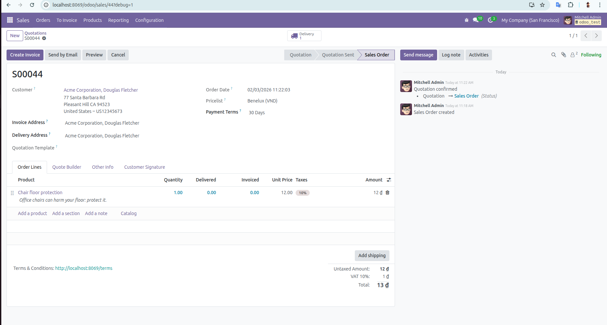

# Ngày 2: Tổng quan ERP & UI/UX

## Khái niệm ERP
ERP (Enterprise Resource Planning)
=> Hệ thống hoạch định nguồn lực doanh nghiệp

ERP là một phần mềm dùng chung để quản lý toàn bộ hoạt động của doanh nghiệp trên một hệ thống duy nhất.

### 🏗️ Kiến trúc tư duy của ERP

ERP (Enterprise Resource Planning) được xây dựng xoay quanh **3 trụ cột chính**:  
**Dữ liệu – Quy trình – Module**

---

#### 1️⃣ Dữ liệu trung tâm (Centralized Database)

- ERP sử dụng **một cơ sở dữ liệu duy nhất** cho toàn bộ hệ thống  
- Trong Odoo, database mặc định là **PostgreSQL**
- Tất cả các module (Sales, Accounting, Inventory, HR, …) **dùng chung dữ liệu**

📌 Lợi ích:
- Tránh trùng lặp dữ liệu
- Đảm bảo tính nhất quán
- Báo cáo real-time, chính xác

---

#### 2️⃣ Quy trình nghiệp vụ (Business Flow)

ERP không chỉ lưu dữ liệu mà còn **chuẩn hóa quy trình vận hành doanh nghiệp**.

Ví dụ các quy trình phổ biến:

- **Bán hàng**  
  Bán → Giao hàng → Xuất hóa đơn → Thu tiền

- **Mua hàng**  
  Mua → Nhận hàng → Ghi nhận chi phí → Thanh toán

📌 Mỗi bước trong quy trình:
- Có trạng thái (state)
- Có kiểm soát
- Có liên kết dữ liệu giữa các bộ phận

---

#### 3️⃣ Module (Phân hệ chức năng)

- Mỗi nghiệp vụ trong ERP được tổ chức thành **một module riêng**
- Ví dụ: Sales, Inventory, Accounting, HR, Manufacturing
- Module có thể:
  - Bật / tắt tùy nhu cầu
  - Cài thêm hoặc gỡ bỏ
  - Mở rộng bằng module tùy chỉnh (custom module)

📌 Đây là điểm mạnh lớn của ERP nói chung và Odoo nói riêng.

##  Thực hiện thủ công quy trình bán hàng trong ERP (Odoo)
Quy trình bán hàng trong ERP được thực hiện theo các bước tuần tự, đảm bảo dữ liệu được liên thông giữa các bộ phận.

### 1️⃣ Tạo báo giá (Quotation)

- Truy cập module **Sales**
- Tạo mới một báo giá cho khách hàng
- Chọn:
  - Khách hàng
  - Sản phẩm
  - Số lượng
  - Giá bán

---

### 2️⃣ Xác nhận đơn hàng (Confirm Sales Order)

- Người dùng xác nhận báo giá
- Báo giá được chuyển thành **Đơn bán hàng (Sales Order)**

---

### 3️⃣ Xuất kho / Giao hàng (Delivery Order)

- Truy cập đơn giao hàng được tạo tự động (bấm vào Delivery)

- Kiểm tra số lượng sản phẩm
- Xác nhận xuất kho (Bấm Create invoce) => (bấm Validate)

---

### 4️⃣ Tạo hóa đơn (Create Invoice)

- Từ đơn bán hàng, tạo hóa đơn cho khách hàng (Bấm nút Create Invoice)=>(Confirm)

- Kiểm tra thông tin:
  - Sản phẩm
  - Số lượng
  - Tổng tiền
  - Thuế

---

