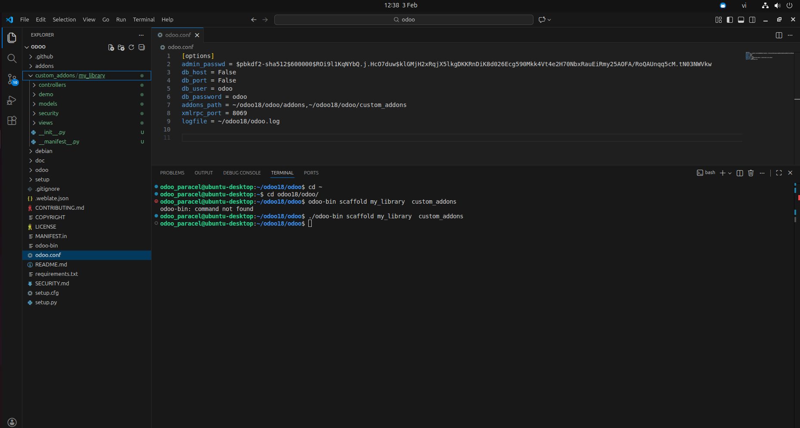

# Ngày 3: Kiến trúc Module

## 📘 Nội dung

### 📂 Cấu trúc thư mục Module Odoo

- Hiểu cấu trúc chuẩn của một module trong Odoo
- Vai trò của từng thư mục:
  - `models/` – định nghĩa dữ liệu (Model)
  - `views/` – giao diện người dùng (View)
  - `security/` – phân quyền & access control
  - `data/` – dữ liệu khởi tạo
  - `__init__.py` – khai báo Python package
  - `__manifest__.py` – thông tin module

---

### 📄 Manifest, Models, Views

- **Manifest (`__manifest__.py`)**
  - Tên module
  - Phiên bản
  - Phụ thuộc (dependencies)
  - Dữ liệu được load (views, security, data)

- **Models**
  - Định nghĩa `_name`
  - Khai báo fields (`Char`, `Integer`, `Date`, ...)
  - Quan hệ (`Many2one`, `One2many`, `Many2many`)

- **Views**
  - Tree View
  - Form View
  - Action & Menu
  - Kết nối view với model

---
### 🛠️ Lệnh `odoo-bin scaffold`

- Dùng để tạo khung module nhanh chóng
- Sinh sẵn cấu trúc thư mục chuẩn của Odoo

Ví dụ:

```
./odoo-bin scaffold my_module custom_addons
```

## 🧪 Tạo module 'my_library' (Quản lý thư viện) rỗng bằng lệnh scaffold.

```
./odoo-bin scaffold my_library custom_addons
```

---



