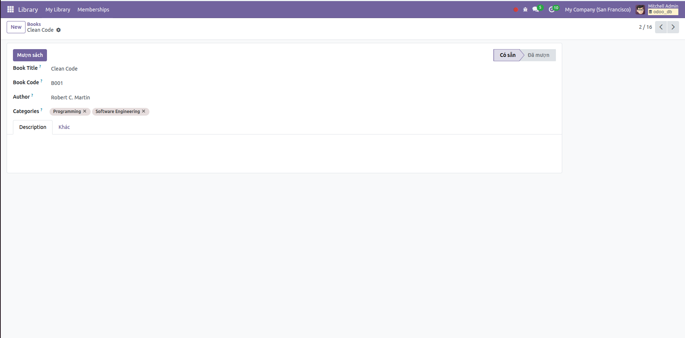
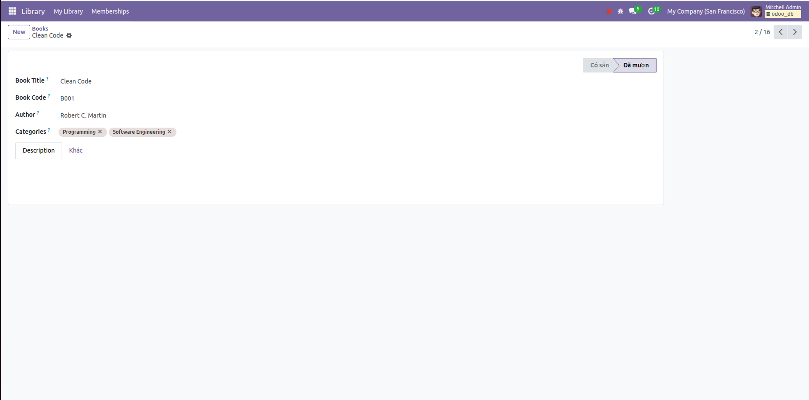
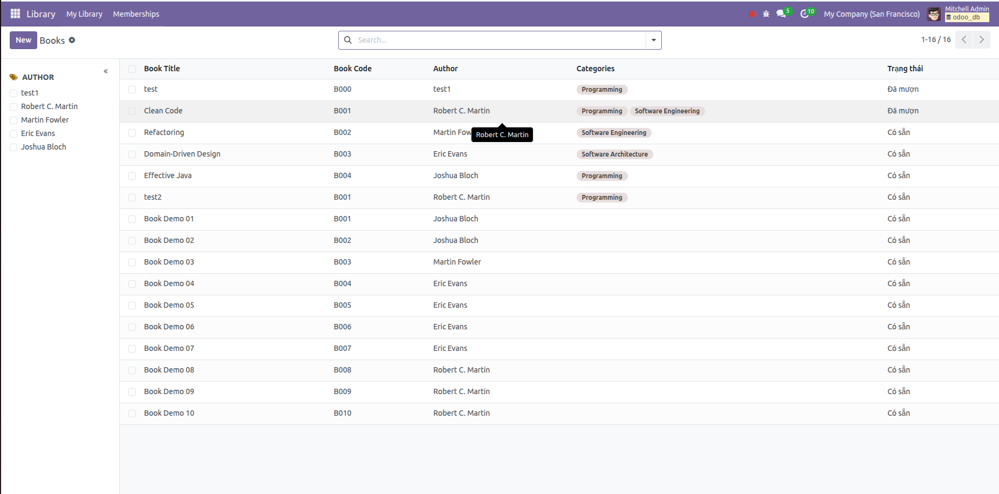

# Ngày 11:  ORM Methods (1)

## 📘 Nội dung học tập – Odoo ORM CƠ BẢN (RẤT QUAN TRỌNG)

### 1️⃣ Environment (env) & self
- `env` là gì?

👉 `env` = môi trường làm việc hiện tại của Odoo

Nó chứa:

- `env.cr` → database cursor
- `env.uid` → user hiện tại
- `env.user` → record user
- `env.context` → context
- `env['model.name']` → truy cập model khác

```
books = self.env['library.book'].search([])
```

---

🔹 self là gì?

👉 self = recordset hiện tại

- Có thể là 1 record
- Hoặc nhiều record
- Luôn iterable
```
for book in self:
    print(book.name)
```
📌 Không bao giờ assume self chỉ có 1 record (trừ khi đảm bảo).

---

### 2️⃣ Search & Browse
🔍 `search()`
👉 Dùng khi cần tìm theo điều kiện
```
books = self.env['library.book'].search([
    ('name', 'ilike', 'Python')
])
```
- Truy vấn DB
- Trả về recordset
- Có thể rỗng

```
books = self.env['library.book'].search([], limit=10)
```

🧭 browse()

👉 Dùng khi đã biết ID
```
book = self.env['library.book'].browse(5)
```
⚠️ browse():

KHÔNG check DB

Nếu ID không tồn tại → record rỗng (ghost record)
```
if book.exists():
    ...
```

---
🆚 So sánh nhanh

|               | search | browse |
| ------------- | ------ | ------ |
| Query DB      | ✅      | ❌      |
| Biết ID trước | ❌      | ✅      |
| Có thể rỗng   | ✅      | ✅      |

---

### 3️⃣ Button Action
🔘 Button trong XML
```
<button name="action_mark_returned"
        string="Mark Returned"
        type="object"
        class="btn-primary"/>
```
📌 type="object" → gọi method Python

🧠 Method trong model
```
def action_mark_returned(self):
    for record in self:
        record.state = 'returned'
```
✔ `self` = record được click
✔ Có thể multi-select → Odoo gọi nhiều record

---

### 4️⃣ Ví dụ LAB: Button mượn sách (chuẩn bài thư viện)
📌 Model library.loan
```
state = fields.Selection([
    ('borrowed', 'Borrowed'),
    ('returned', 'Returned')
], default='borrowed')
```
🔘 Button trong form view
```
<button name="action_return_book"
        string="Return Book"
        type="object"
        class="btn-success"
        attrs="{'invisible': [('state', '=', 'returned')]}"/>
```
🧠 Python xử lý
```
def action_return_book(self):
    for loan in self:
        loan.write({
            'state': 'returned',
            'date_return': fields.Date.today()
        })
```

---

### 5️⃣ Dùng env + search trong Button Action
📌 Ví dụ: kiểm tra sách đang được mượn chưa
```
def action_borrow(self):
    for loan in self:
        existing = self.env['library.loan'].search([
            ('book_id', '=', loan.book_id.id),
            ('state', '=', 'borrowed')
        ], limit=1)

        if existing:
            raise UserError('Book is already borrowed')

        loan.state = 'borrowed'
```

---

### 6️⃣ Công thức vàng cần thuộc lòng
```
env['model']  → truy cập model khác
self          → record đang thao tác
search        → tìm dữ liệu
browse        → lấy theo ID
button        → gọi method Python
```

---

## 🧪 Bài tập Lab
Viết nút 'Mượn sách': Click nút -> Đổi trạng thái sách từ 'Có sẵn' sang 'Đã mượn'.

---

### form button


### change state


### update view list
