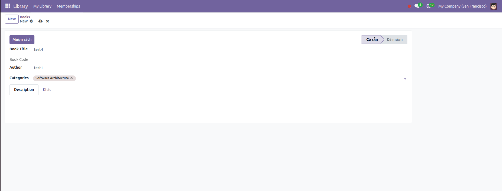

# Ngày 12:  ORM Methods (2)

### 1️⃣ Override `create / write / unlink`

Ba hàm này là core ORM lifecycle – dùng để:
- kiểm soát dữ liệu trước / sau khi lưu
- tự động sinh dữ liệu
- validate nghiệp vụ
- log, sync, gửi socket, v.v.

🔹 create()

Gọi khi tạo record mới

Mục đích thường dùng
- Set giá trị mặc định nâng cao
- Tạo code tự động
- Tạo record liên quan
- Validate dữ liệu đầu vào

VD
```
from odoo import models, api

class LibraryBook(models.Model):
    _name = 'library.book'

    @api.model
    def create(self, vals):
        if not vals.get('code'):
            vals['code'] = 'BOOK-NEW'

        record = super().create(vals)
        return record
```
📌 Lưu ý
- create nhận vals (dict)
- self lúc này chưa có record
- Phải return record do super() tạo

🔹 `write()`

Gọi khi cập nhật record

Mục đích thường dùng
- Chặn sửa dữ liệu
- Update field phụ thuộc
- Log lịch sử thay đổi
- Gửi notify / socket
```
def write(self, vals):
    if 'price' in vals and vals['price'] < 0:
        raise ValueError("Giá không hợp lệ")

    res = super().write(vals)
    return res
```
📌 Lưu ý

- `self` có thể chứa nhiều record
- `write` trả về  `True / False`

🔹 `unlink()`

Gọi khi xóa record
- Mục đích thường dùng
- Không cho xóa dữ liệu quan trọng
- Soft delete
- Cleanup dữ liệu liên quan

```
def unlink(self):
    for rec in self:
        if rec.state == 'done':
            raise ValueError("Không được xóa bản ghi đã hoàn thành")

    return super().unlink()
```
📌 Lưu ý
- unlink không nhận vals
- self là recordset sắp bị xóa

---

### 2️⃣ super() – tại sao BẮT BUỘC phải dùng?

👉 super() gọi logic gốc của Odoo ORM

Nếu không gọi super():

❌ Record không được lưu DB

❌ Trigger, constraint, compute không chạy

❌ Odoo có thể crash ngầm

---

### 3️⃣ Thứ tự chạy trong thực tế
Khi `create`
```
create()
 └─ super().create()
     ├─ SQL INSERT
     ├─ compute fields
     ├─ constraints
     └─ return record
```

Khi `write`
```
write()
 └─ super().write()
     ├─ SQL UPDATE
     ├─ recompute
     └─ constraints
```

---

## 🧪 Bài tập Lab
Tự động sinh mã sách (VD: LIB-001) khi người dùng bấm Lưu (Override hàm create).

`model/book.py`

```
@api.model
def create(self, vals):
    if not vals.get('code'):
        last_book = self.search([], order='id desc', limit=1)

        if last_book and last_book.code:
            number = int(last_book.code[1:]) + 1  # 👈 bỏ chữ B
        else:
            number = 1

        vals['code'] = f"B{number:03d}"

    return super().create(vals)
```

### Result

