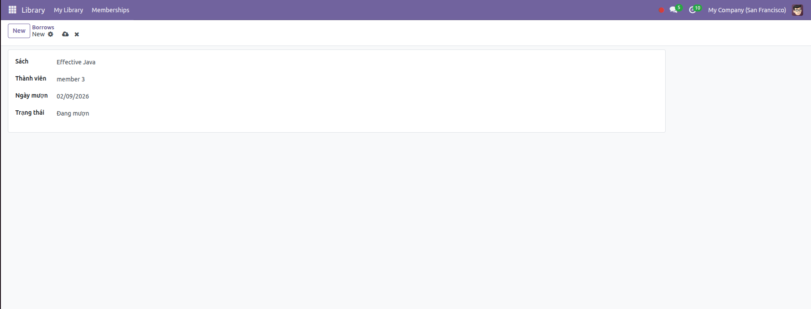
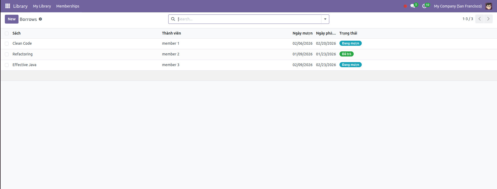

# Ngày 13:  Compute & Onchange

## Nội dung bài học

### 1️⃣ `@api.depends` – Field TÍNH TOÁN

👉 Dùng để tính giá trị tự động dựa trên field khác
👉 Giá trị được lưu DB (nếu store=True)

🔹 Ví dụ cơ bản
```
from odoo import models, fields, api

class LibraryBook(models.Model):
    _name = 'library.book'

    price = fields.Float(string="Giá")
    quantity = fields.Integer(string="Số lượng")

    total_value = fields.Float(
        string="Tổng giá trị",
        compute="_compute_total_value",
        store=True
    )

    @api.depends('price', 'quantity')
    def _compute_total_value(self):
        for rec in self:
            rec.total_value = rec.price * rec.quantity
```
🧪 Hoạt động thế nào?

- Sửa `price` hoặc `quantity`
- Odoo tự gọi `_compute_total_value`
- Cập nhật `total_value`
- Lưu vào DB (do `store=True`)

---
⚠️ Lưu ý quan trọng
- @api.depends KHÔNG dùng cho UI logic
- Phải gán giá trị cho mọi record
- Không được return

---

### 2️⃣ @api.onchange – Phản ứng khi user nhập liệu

👉 Dùng để:
- Auto điền dữ liệu
- Hiện cảnh báo
- Điều chỉnh field tạm thời

🔹 Ví dụ cơ bản
```
from odoo import models, fields, api

class LibraryBook(models.Model):
    _name = 'library.book'

    price = fields.Float(string="Giá")
    discount = fields.Float(string="Giảm giá (%)")

    final_price = fields.Float(string="Giá sau giảm")

    @api.onchange('price', 'discount')
    def _onchange_price_discount(self):
        if self.price and self.discount:
            self.final_price = self.price * (1 - self.discount / 100)
```

🧪 Hoạt động thế nào?
- User gõ `price` hoặc `discount`
- UI gọi `onchange`
- `final_price` thay đổi ngay trên form
- ❌ Chưa lưu DB

🚨 Cảnh báo trong onchange
```
@api.onchange('quantity')
def _onchange_quantity(self):
    if self.quantity < 0:
        return {
            'warning': {
                'title': 'Cảnh báo',
                'message': 'Số lượng không được âm'
            }
        }
```

---

## 🧪 Bài tập Lab
Tự động tính 'Ngày phải trả' = 'Ngày mượn' + 14 ngày. Hiển thị ngay khi chọn ngày mượn.

form


result


