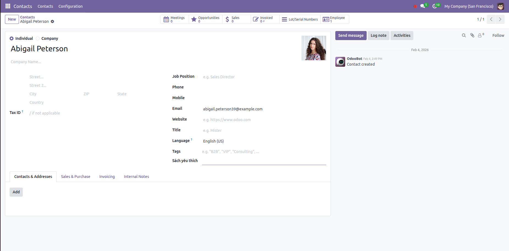

# Ngày 14:  Inheritance (Kế thừa)

## Nội dung bài học

### 1️⃣ `_inherit` trong Model
🔹 `_inherit` dùng để làm gì?

Dùng để mở rộng / ghi đè một model đã có sẵn mà không sửa code gốc.

Đây là triết lý sống còn của Odoo: extend, don’t modify 😄

---

🔹 Các kiểu _inherit phổ biến
✅ 1. Mở rộng model có sẵn
```
from odoo import models, fields

class ResPartner(models.Model):
    _inherit = 'res.partner'

    code = fields.Char(string="Customer Code")
```
➡️ Thêm field `code` vào model `res.partner`.

✅ 2. Override method (create / write / unlink…)
```
class ResPartner(models.Model):
    _inherit = 'res.partner'

    def create(self, vals):
        res = super().create(vals)
        # xử lý thêm
        return res
```
📌 Luôn gọi super() nếu không muốn phá logic gốc của Odoo.

---
❌ Khi KHÔNG dùng _inherit

Muốn tạo model hoàn toàn mới → dùng _name

Muốn thay đổi DB structure cũ → phải cẩn thận (migrate)

---

### 2️⃣ XPath trong View
🔹 XPath là gì?

XPath dùng để chèn / sửa / ẩn / thay đổi view gốc (form, tree, kanban…) mà không đụng vào XML gốc.

🔹 Cấu trúc chuẩn của view kế thừa
```
<record id="view_partner_form_inherit" model="ir.ui.view">
    <field name="name">res.partner.form.inherit</field>
    <field name="model">res.partner</field>
    <field name="inherit_id" ref="base.view_partner_form"/>
    <field name="arch" type="xml">
        <!-- xpath ở đây -->
    </field>
</record>
```

---

🔹 Các XPath hay dùng nhất
✅ 1. Chèn field sau field khác
```
<xpath expr="//field[@name='name']" position="after">
    <field name="code"/>
</xpath>
```
✅ 2. Ẩn field
```
<xpath expr="//field[@name='phone']" position="attributes">
    <attribute name="invisible">1</attribute>
</xpath>
```
✅ 3. Thêm nút button
```
<xpath expr="//header" position="inside">
    <button name="action_confirm"
            type="object"
            string="Confirm"
            class="btn-primary"/>
</xpath>
```
✅ 4. Thay đổi label
```
<xpath expr="//field[@name='email']" position="attributes">
    <attribute name="string">Email liên hệ</attribute>
</xpath>
```

---
Tóm tắt
| Nội dung           | Dùng khi nào                                   |
| ------------------ | ---------------------------------------------- |
| `_inherit (Model)` | Thêm field / override logic                    |
| `super()`          | Luôn gọi khi override                          |
| XPath              | Sửa giao diện                                  |
| `inherit_id`       | Kế thừa view gốc                               |
| `position`         | after / before / inside / replace / attributes |

---

## 🧪 Bài tập Lab
Kế thừa module Contacts (res.partner): Thêm trường 'Sách yêu thích' vào hồ sơ đối tác.

